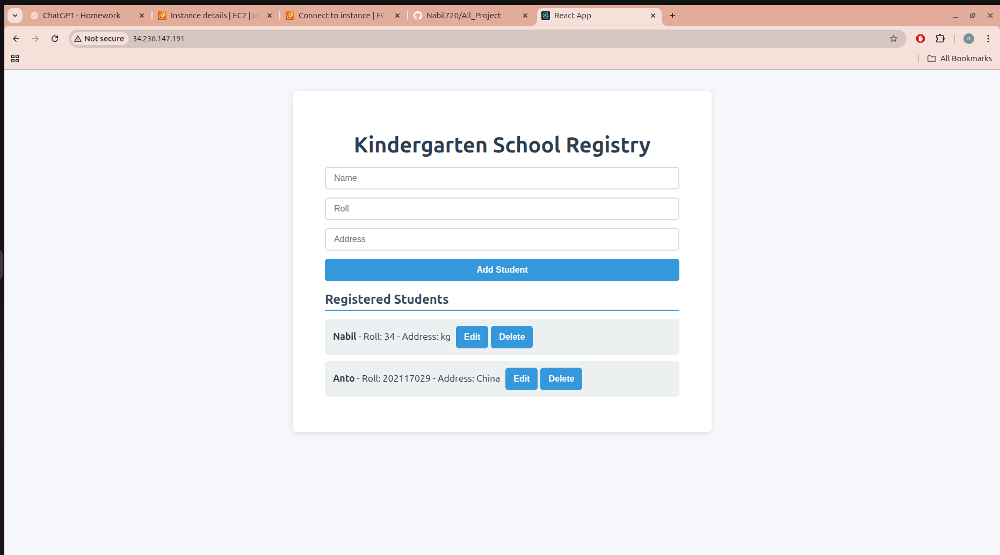
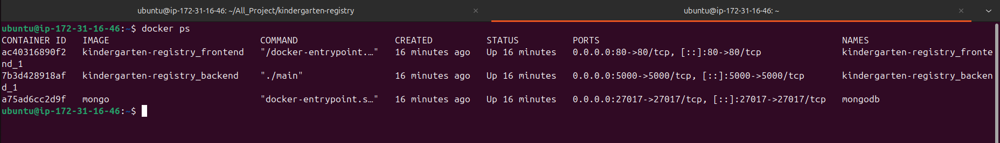

<h1 style="color: #1bf89cff; font-size: 48px; font-weight: bold;">Docker based hosting</h1>


## Kindergarten Registry

A full-stack React + Node.js + MongoDB application deployed using Docker.


## Step-by-Step Deployment Guide

### Launch EC2 Instance
1. Create an EC2 instance using **Ubuntu 22.04 (t3.micro)**.  
2.  Connect via SSH:
   ```bash
   ssh -i key.pem ubuntu@<EC2_PUBLIC_IP>
```

3. Clone the repository

```bash
git clone https://github.com/Nabil720/Task.git
cd Task/kindergarten-registry_Docker
```
4. Update system and install dependencies

```
sudo apt update -y
sudo apt upgrade -y
sudo apt install docker.io docker-compose -y
sudo systemctl start docker
sudo systemctl enable docker
sudo usermod -aG docker $USER
newgrp docker
```


```
Task/
└── kindergarten-registry_Docker/
    ├── backend/          # Node.js/Express backend
    ├── frontend/         # React frontend
    │   ├── build/        # Production build (generated)
    │   └── nginx.conf    # Nginx reverse proxy config
    └── docker-compose.yml
```

3. Build frontend

```
cd frontend
npm install
npm run build
```

## docker-compose up -d


##  Applicatio architecture


```

                        +-----------------------+
                        |     Web Browser       |
                        |   (User Interface)    |
                        +-----------+-----------+
                                    |
                                    v
                        +-----------------------+
                        |      Nginx Container   |
                        |  (Serves React + API)  |
                        +-----------+-----------+
                                    |
               +--------------------+--------------------+
               |                                         |
               v                                         v
     +--------------------+                    +---------------------+
     | React Frontend App |                    |       go  Backend   |
     | (Static Build in   |                    | (Express API Server |
     | Nginx HTML folder) |                    |  on /api/* routes)  |
     +--------------------+                    +----------+----------+
                                                          |
                                                          v
                                             +------------------------+
                                             |      MongoDB Container |
                                             |   (Student Data Store) |
                                             +------------------------+

         All services run as Docker containers using `docker-compose`

         +----------------------------------------------------------+
         |                   Host Machine (e.g., Ubuntu VM)         |
         |  - Docker Engine                                         |
         |  - docker-compose                                        |
         |  - Exposes ports to internet (via Nginx on port 80)      |
         +----------------------------------------------------------+


```







