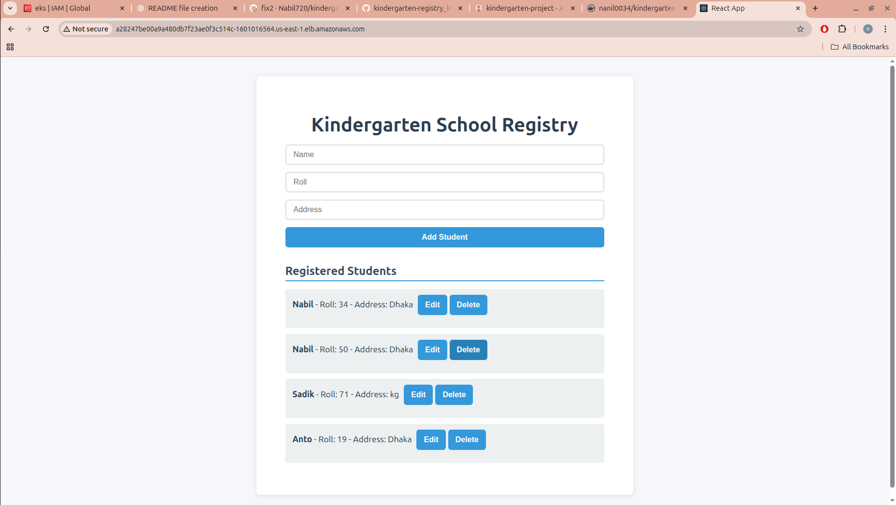
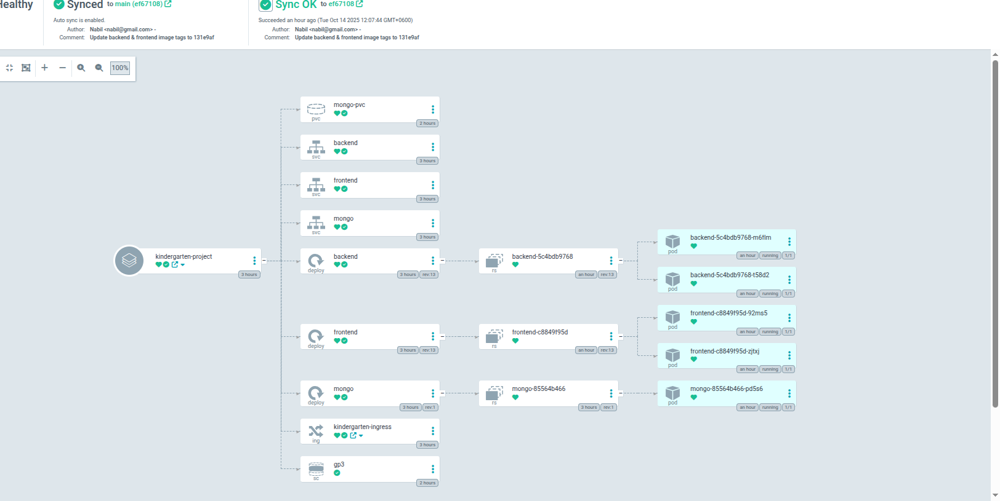
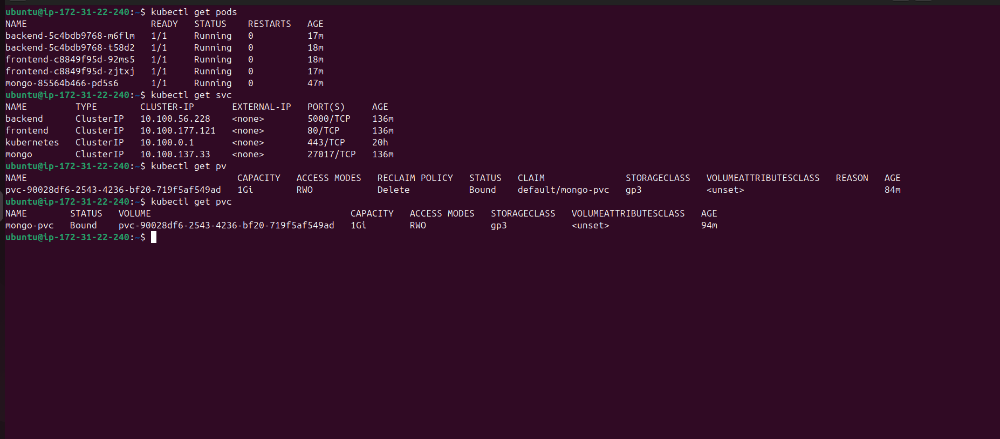

<h1 style="color: #1bf89cff; font-size: 48px; font-weight: bold;">EKS Cluster based hosting</h1>


## Step-by-Step Deployment Guide

### Launch EC2 Instance
1. Create an EC2 instance using **Ubuntu 22.04 (t3.micro)**.  
2.  Connect via SSH:
   ```bash
   ssh -i key.pem ubuntu@<EC2_PUBLIC_IP>
```


## Install Tools

```
# update
sudo apt update -y
sudo apt upgrade -y

# Install jq, curl, unzip 
sudo apt install -y curl unzip jq

# Install AWS CLI v2
curl "https://awscli.amazonaws.com/awscli-exe-linux-x86_64.zip" -o "awscliv2.zip"
unzip awscliv2.zip
sudo ./aws/install
rm -rf awscliv2.zip aws

# Install kubectl
curl -LO "https://dl.k8s.io/release/$(curl -L -s https://dl.k8s.io/release/stable.txt)/bin/linux/amd64/kubectl"
sudo install -o root -g root -m 0755 kubectl /usr/local/bin/kubectl
rm kubectl

# Install eksctl (the easiest way to create EKS)
curl --silent --location "https://github.com/weaveworks/eksctl/releases/latest/download/eksctl_$(uname -s)_amd64.tar.gz" | tar xz -C /tmp
sudo mv /tmp/eksctl /usr/local/bin

# (Optional) Install helm if you want to use it later
curl https://raw.githubusercontent.com/helm/helm/main/scripts/get-helm-3 | bash

```
## AWS CLI credentials
```
aws configure
# AWS Access Key ID [None]: <YOUR_ACCESS_KEY>
# AWS Secret Access Key [None]: <YOUR_SECRET_KEY>
# Default region name [None]: us-east-1   
# Default output format [None]: json
```
## EKS Cluster
```
eksctl create cluster \
  --name kindergarten-cluster \
  --region us-east-1 \
  --nodegroup-name ng-standard \
  --node-type t3.small \
  --nodes 2 \
  --nodes-min 1 \
  --nodes-max 3 \
  --managed

# Chack
kubectl get nodes
kubectl get ns
```

## Install Argo CD

```
# create namespace and install
kubectl create namespace argocd
kubectl apply -n argocd -f https://raw.githubusercontent.com/argoproj/argo-cd/stable/manifests/install.yaml

# Argo CD server expose
kubectl -n argocd patch svc argocd-server -p '{"spec": {"type": "LoadBalancer"}}'
kubectl get svc -n argocd

# Argo CD initial password
kubectl get secret -n argocd argocd-initial-admin-secret -o jsonpath="{.data.password}" | base64 -d && echo
```
## Nginx ingress controller install
```
helm repo add ingress-nginx https://kubernetes.github.io/ingress-nginx
helm repo update
helm install nginx-ingress ingress-nginx/ingress-nginx \
  --namespace ingress-nginx --create-namespace \
  --set controller.publishService.enabled=true

# chack
kubectl get svc -n ingress-nginx

```


##  Applicatio architecture

```
                                   +-----------------------+
                                   |    Web Browser        |
                                   | (React Frontend UI)   |
                                   +-----------+-----------+
                                               |
                                               v
                                   +-----------------------+
                                   |     Nginx Ingress     |
                                   | (Routing and Proxy)   |
                                   +-----------+-----------+
                                               |
                                               v
                     +--------------------------------------------+
                     |   EKS Cluster (Kubernetes Environment)     |
                     |                                            |
                     |  +-------------------+   +-------------+ |
                     |  |   React Frontend   |   | go           | |
                     |  | (Pod - Static App) |   | Backend      | |
                     |  | (Nginx Serve)      |   | (Express API)| |
                     |  +-------------------+   +-------------+ |
                     |             |                  |         |
                     |             v                  v         |
                     |  +--------------------------+------------+|
                     |  |     MongoDB (Pod)         |            |
                     |  | (Persistent Volume)       |            |
                     |  +--------------------------+------------+|
                     +--------------------------------------------+
                                    |
                                    v
                          +------------------------+
                          |     AWS EBS (Storage)  |
                          | (Persistent Volumes)   |
                          +------------------------+


```







